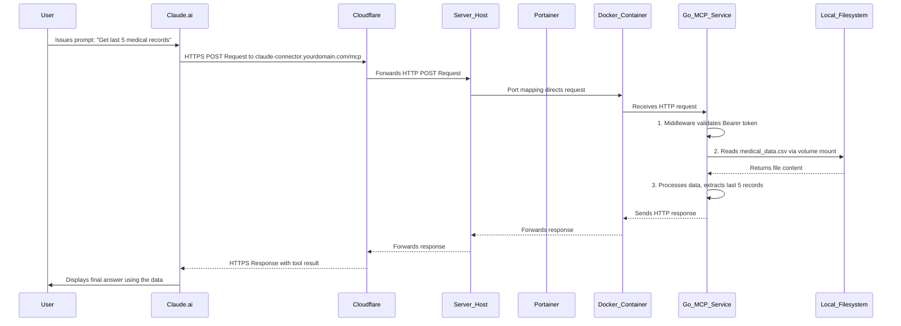

# System Architecture Blueprint

## 1.1. Executive Summary

This document outlines the system architecture for a secure, self-hosted, private connector designed to integrate with the Claude.ai platform. The primary objective of this system is to grant the Claude AI controlled, read-only access to a specific subset of sensitive local data—in this case, personal medical records stored in a CSV file—without the data ever leaving the user's privately managed server infrastructure. The architecture is founded upon three core principles: absolute data sovereignty, security-in-depth, and operational simplicity achieved through modern containerization and deployment practices. By leveraging the Model Context Protocol (MCP), this system provides a robust and private bridge between a powerful large language model and a user's personal data corpus, enabling context-aware AI assistance while maintaining the highest standards of privacy and control.

## 1.2. High-Level System Diagram

The following diagram illustrates the flow of information and the interaction between the system's components. A request originates from the user within the Claude.ai interface, travels securely over the public internet via Cloudflare, is processed by the Go MCP service running in a Docker container on the user's server, and a result is returned along the same path.

## 1.3. Component Responsibilities

The system is composed of several distinct components, each with a clearly defined role and responsibility, ensuring a modular and maintainable architecture.

### 1.3.1. Claude.ai Client (Pro/Max Plan)

The Claude.ai web or desktop client serves as the user interface and the initiator of all tool-use requests. Access to custom connectors via remote MCP servers is a feature available on paid plans such as Pro, Max, Team, and Enterprise. Its primary responsibilities are:

- **User Interaction**: To accept natural language prompts from the user.
- **Tool Recognition**: To parse the user's prompt and identify that it requires the use of a configured custom connector.
- **MCP Request Formatting**: To construct a valid JSON-RPC 2.0 request according to the Model Context Protocol (MCP) specification, encapsulating the tool name (get_last_n_records) and its arguments.
- **Secure Communication**: To dispatch this request via HTTPS to the publicly accessible URL of the custom connector.

### 1.3.2. Cloudflare

Cloudflare acts as the secure, public-facing gateway for the self-hosted service. It sits between the public internet and the user's server, providing critical security and networking services without requiring complex configuration on the origin server. Its responsibilities include:

- **DNS Management**: It resolves the custom domain (e.g., claude-connector.yourdomain.com) to the public IP address of the user's server, directing traffic correctly.
- **TLS/SSL Termination**: It provides and manages the SSL certificate, terminating the encrypted HTTPS connection from the Claude client. All traffic between Claude and the user's infrastructure boundary is encrypted with industry-standard protocols. The connection from Cloudflare to the origin server can be plain HTTP, simplifying the Go application's code as it does not need to manage TLS certificates.
- **Reverse Proxy and Security Layer**: It acts as a reverse proxy, which can obscure the origin server's true IP address. This provides a first line of defense, including robust, unmetered DDoS mitigation and a web application firewall (WAF) that can be configured to block malicious traffic patterns.

### 1.3.3. Server with Portainer & Docker

This is the user-managed physical or virtual machine that hosts the core application.

- **Docker Engine**: The underlying container runtime environment. It is responsible for building Docker images from a Dockerfile and running containers as defined in a docker-compose.yml file, ensuring application isolation and reproducibility.
- **Portainer**: A graphical user interface for Docker management. Its role is to simplify the deployment and lifecycle management of the connector. It allows the user to deploy the application from a docker-compose.yml file, manage environment variables securely, and monitor container logs for troubleshooting.

### 1.3.4. Go MCP Service (The Connector)

This is the core of the project—a custom-built application written in Go, running inside a Docker container. It implements the server-side of the Model Context Protocol. Its responsibilities are:

- **HTTP Server**: To listen for incoming HTTP POST requests on a designated port within the container.
- **Authentication Middleware**: To intercept every incoming request and validate a secret Bearer token provided in the Authorization header. This is the primary application-level security control, rejecting any unauthorized attempts to use the tool.
- **MCP Handler**: To parse the JSON-RPC 2.0 request body, identify the specific tool being called (get_last_n_records), and correctly extract its parameters (e.g., the integer N).
- **Tool Execution Logic**: To implement the business logic of the tool—in this case, opening the specified CSV file from the mounted volume, reading its contents, and isolating the last N records.
- **MCP Response Formatting**: To package the retrieved data into a valid MCP tool_result content block and return it as the body of the HTTP response, which Claude then uses to formulate its final answer to the user.

### 1.3.5. Local Filesystem

The host machine's filesystem provides persistent storage for the sensitive data. A specific directory on the host (e.g., /opt/claude-connector/data) is mounted into the Docker container as a volume. This critical design choice ensures:

- **Data Persistence**: The medical_data.csv file resides on the host and is not lost if the container is stopped or recreated.
- **Data Isolation**: The sensitive data is not part of the Docker image itself. The image contains only the application code, making it safer to store in a registry. The data is only attached at runtime.

## 1.4. Data Flow and Security Model

The system's design prioritizes security through a layered approach, often referred to as "security-in-depth." This ensures that a failure in one layer does not lead to a catastrophic data breach.

### 1.4.1. Request Lifecycle

- **Prompt**: The user issues a prompt in the Claude.ai interface that requires the custom tool.
- **HTTPS Request**: Claude's backend sends a secure HTTPS POST request to the Cloudflare-managed domain. The request body is a JSON-RPC payload, and the headers include the secret Authorization: Bearer <token>.
- **Cloudflare Processing**: Cloudflare terminates the HTTPS connection, inspects the traffic for threats (if configured), and forwards the request as a plain HTTP POST request to the origin server's public IP address.
- **Container Routing**: The server's OS receives the request on a public port (e.g., 8080) and, per the docker-compose.yml port mapping, routes it to the corresponding port inside the running Docker container.
- **Application Handling**: The Go MCP service receives the request.
- **Authentication**: The authentication middleware is the first code to execute. It inspects the Authorization header. If the token is missing or invalid, it immediately returns an HTTP 401 Unauthorized response, and the process stops.
- **Tool Execution**: If authentication succeeds, the MCP handler parses the request, identifies the get_last_n_records tool call, and invokes the corresponding Go function.
- **Data Access**: The Go function reads the medical_data.csv file from its path inside the container (e.g., /data/medical_data.csv), which maps directly to the file on the host's filesystem.
- **Response Generation**: The function processes the data in memory, extracts the required records, and formats them into a valid MCP response structure.
- **Secure Return Path**: The HTTP response travels back through the Docker container, the host server, and to Cloudflare. Cloudflare then encrypts the response and sends it back to the Claude.ai backend via HTTPS.
- **Final Answer**: Claude receives the tool result, uses the data to formulate a natural language response, and presents it to the user.

### 1.4.2. Security-in-Depth Analysis

This architecture establishes multiple, independent layers of security to protect the sensitive medical data.

- **Layer 1: Network Security (Transport Layer)**: Cloudflare's mandatory TLS/SSL encryption for all traffic to the proxied domain protects the data in transit. This mitigates the risk of man-in-the-middle (MITM) attacks and network eavesdropping between the Claude client and the user's network boundary.
- **Layer 2: Application Security (Authentication)**: The use of a high-entropy, secret Bearer token acts as a robust authentication mechanism. While the MCP specification supports complex OAuth 2.0 flows, this is often challenging to implement correctly for private, single-user servers. For this specific use case, a static API key (Bearer token) provides an equivalent level of security against unauthorized access with significantly less complexity. An attacker would need to guess both the endpoint URL and the secret token to gain access.
- **Layer 3: Infrastructure Security (Isolation)**: Docker containerization isolates the Go application and its dependencies from the host operating system. This prevents potential vulnerabilities in the application or its libraries from affecting the host server. Furthermore, mounting the data volume as read-only within the docker-compose.yml file can provide an additional layer of hardening, ensuring the application cannot accidentally or maliciously modify the source data file.
- **Layer 4: Data Security (Sovereignty)**: The most critical security guarantee of this architecture is data sovereignty. The full medical_data.csv file is never transmitted over the network. It is read into the container's memory, processed locally, and only the specific, requested subset of data (the result of the tool call) is sent back to Claude. The complete dataset remains within the user's control and on their infrastructure at all times.

This multi-layered model ensures that the system is resilient and that the user's private data is protected by a combination of network encryption, application-level authentication, infrastructure isolation, and a strict data-locality policy.