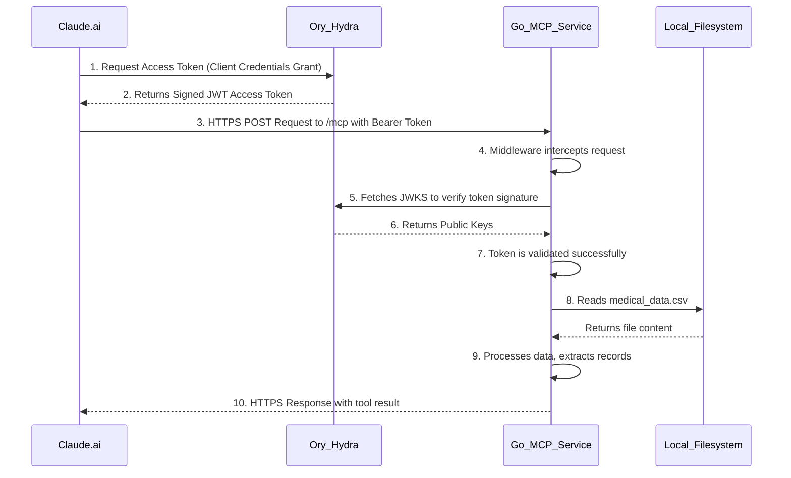

# System Architecture Blueprint

## 1.1. Executive Summary

This document outlines the system architecture for a secure, self-hosted, private connector designed to integrate with the Claude.ai platform. The architecture is built around a multi-container Docker environment that includes the core Go connector application and Ory Hydra, a certified OAuth 2.0 and OpenID Connect provider. This design ensures robust, standards-based security, delegating the complexities of authentication to a dedicated service. The primary objective remains to grant Claude.ai controlled, read-only access to sensitive local data (a CSV file) while maintaining absolute data sovereignty and the highest standards of privacy.

## 1.2. High-Level System Diagram

The following diagram illustrates the flow of information between the system's components. Claude.ai, configured with client credentials, requests an access token from Ory Hydra and then uses that token to make a secure request to the Go MCP service.

### 1.3.1. Go MCP Service (The Connector)

This is the core application, a Go service running in a Docker container. Its responsibilities are now simplified:

- **HTTP Server**: Listens for incoming HTTP POST requests on the `/mcp` endpoint.
- **Authentication Middleware**: Intercepts every request to `/mcp`. It extracts the Bearer token from the `Authorization` header and validates it. This is no longer a simple string comparison but a full JWT validation against the public keys provided by the Ory Hydra service.
- **Tool Execution Logic**: Implements the business logic of the `get_last_n_records` tool, reading from the CSV file and returning the result.

### 1.3.2. Ory Hydra (OAuth 2.0 Provider)

Ory Hydra is a dedicated, open-source service that handles all aspects of OAuth 2.0 and OpenID Connect. It runs in its own Docker container and uses a PostgreSQL database for persistence. Its responsibilities include:

- **Client Management**: Manages registered OAuth2 clients. Our Go connector is registered as a client.
- **Token Issuance**: Issues secure, signed JSON Web Tokens (JWTs) to authenticated clients. For this use case, it uses the `client_credentials` grant, which is ideal for machine-to-machine communication.
- **Token Validation Support**: Provides a `.well-known/jwks.json` endpoint where client applications (like our Go connector) can fetch the public keys needed to verify the signature of the JWTs it issues.

### 1.3.3. Supporting Services

- **`hydra-db`**: A PostgreSQL container that provides a persistent database for Ory Hydra.
- **`consent`**: A simple, pre-built login and consent UI. While the `client_credentials` flow does not require user interaction, this service is included for completeness and to support other OAuth2 flows if needed in the future.

## 1.4. Data Flow and Security Model

The security model is now based on a standard, robust OAuth 2.0 flow, which separates the concerns of authentication and application logic.

### 1.4.1. Request Lifecycle

1.  **Token Request**: Claude.ai, configured with the Client ID and Client Secret for the connector, makes a request to the Ory Hydra `/oauth2/token` endpoint.
2.  **Token Issuance**: Hydra validates the client credentials and, if valid, issues a short-lived, signed JWT access token.
3.  **MCP Request**: Claude.ai makes a request to the Go connector's `/mcp` endpoint, including the JWT access token in the `Authorization: Bearer <token>` header.
4.  **Token Validation**: The Go connector's `AuthMiddleware` intercepts the request.
    - It fetches the JSON Web Key Set (JWKS) from Hydra's `/.well-known/jwks.json` endpoint (caching it for performance).
    - It parses the JWT, checks its signature against the public keys from the JWKS, and verifies standard claims like the expiration time and issuer.
    - If the token is valid, the request is allowed to proceed. If not, an HTTP 401 Unauthorized error is returned.
5.  **Tool Execution**: The `MCPHandler` executes the requested tool (`get_last_n_records`), reads from the local CSV file, and processes the data.
6.  **Response**: The result is returned to Claude.ai.

### 1.4.2. Security-in-Depth Analysis

- **Layer 1: Network Security**: All external traffic is expected to be routed through a reverse proxy like Cloudflare or Traefik, which provides TLS/SSL encryption.
- **Layer 2: Authentication Security**: Authentication is handled by Ory Hydra, a dedicated and certified security component. This is significantly more secure than a custom-built or static token approach. It uses standard JWTs and the `client_credentials` flow, which is appropriate for server-to-server communication.
- **Layer 3: Infrastructure Security**: Docker containerization isolates all services (Go connector, Hydra, database) from each other and the host system. The Docker network ensures that services can communicate securely while only exposing the necessary ports to the outside world.
- **Layer 4: Data Security (Sovereignty)**: This remains the core guarantee. The sensitive data in the CSV file never leaves the host server. The Go connector processes it in memory and only returns the specific subset of data requested by the tool call.